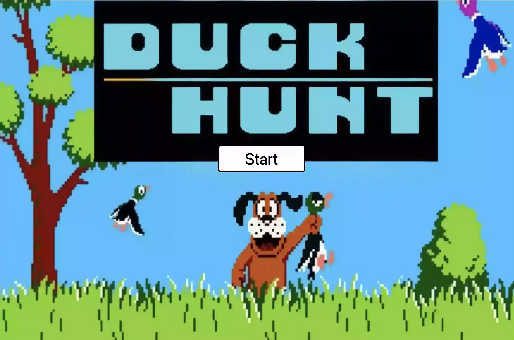
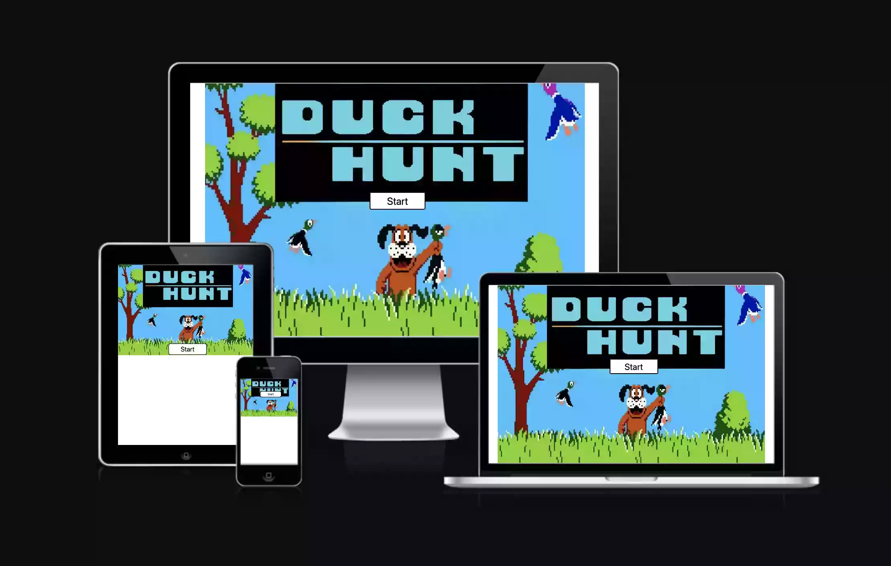
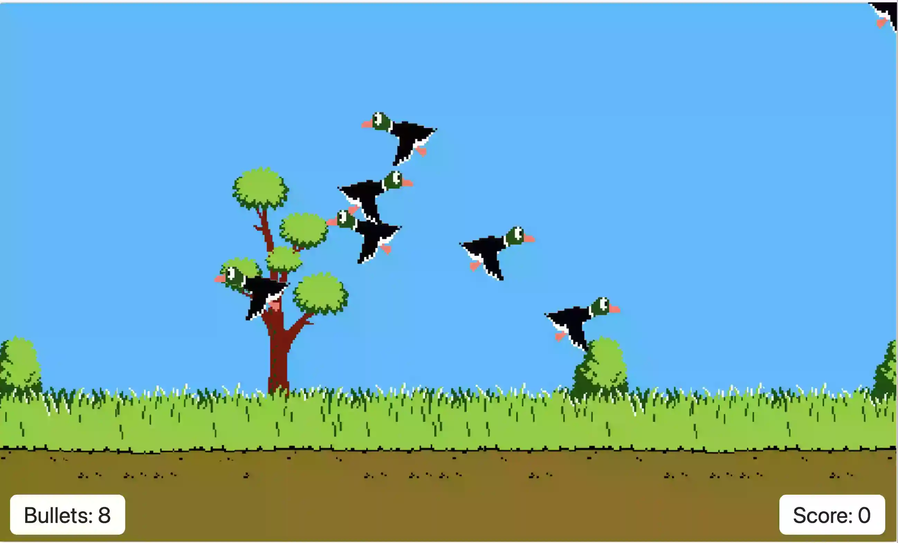
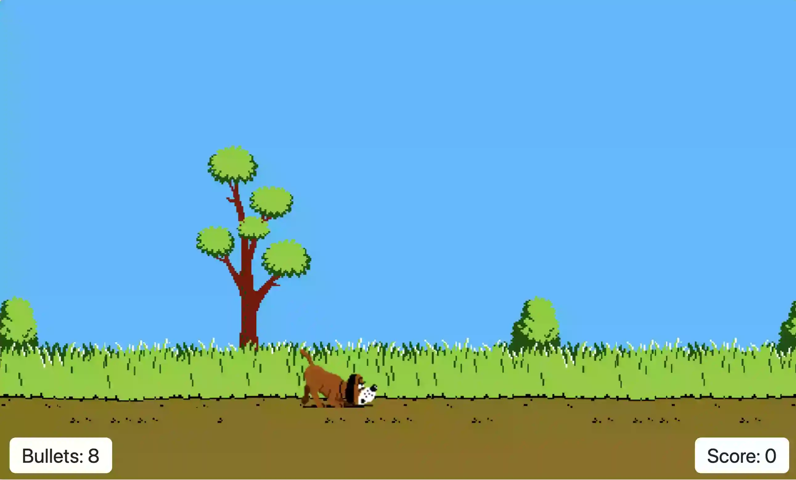
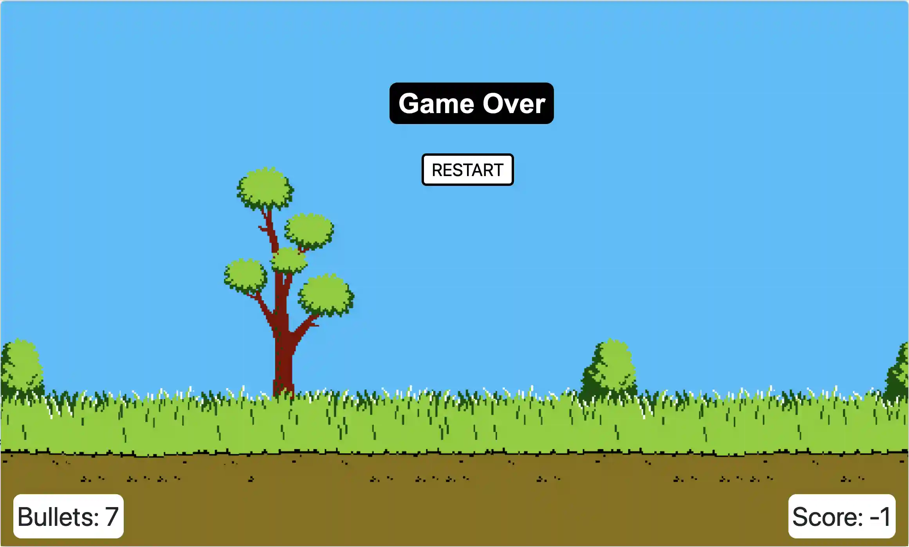
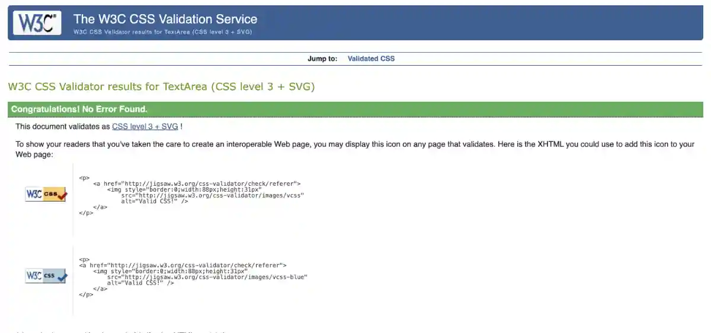
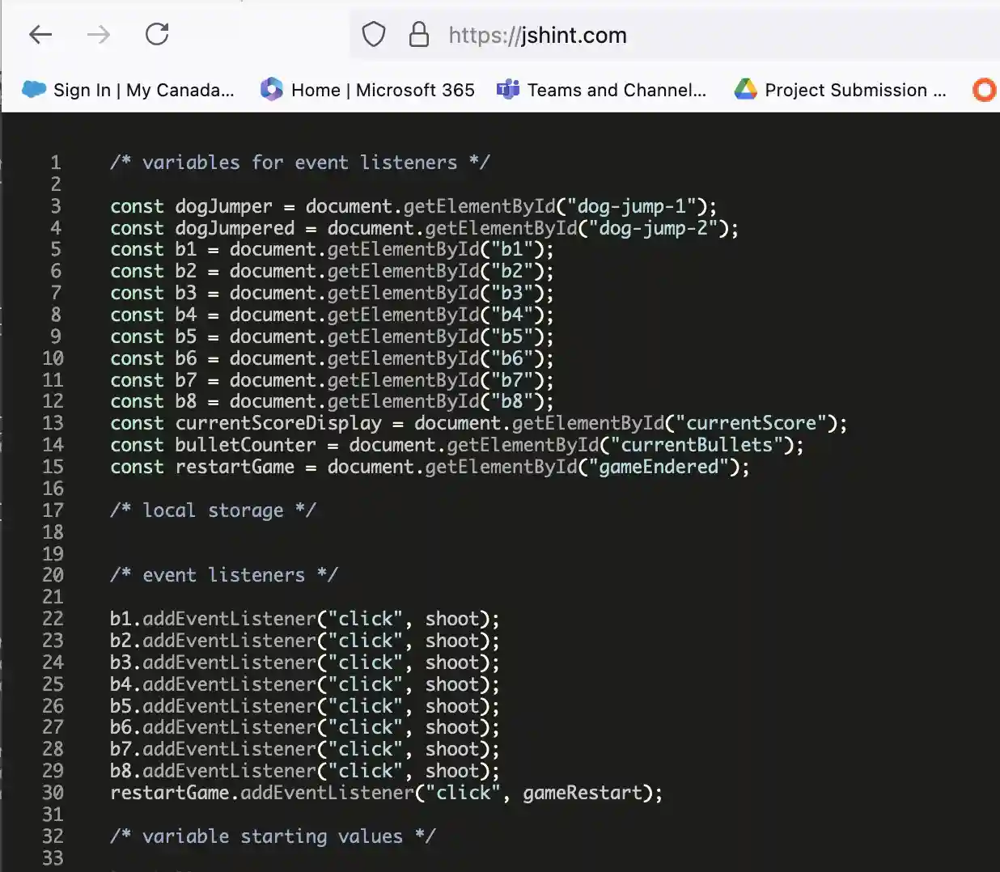
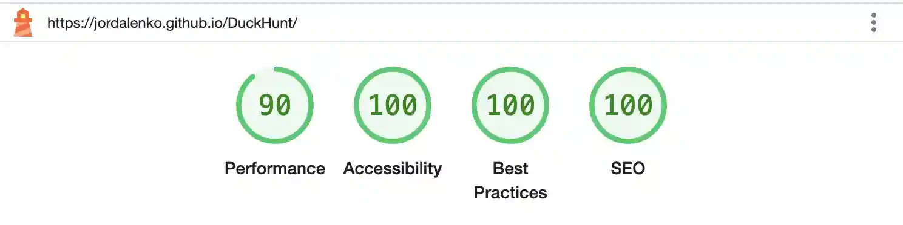
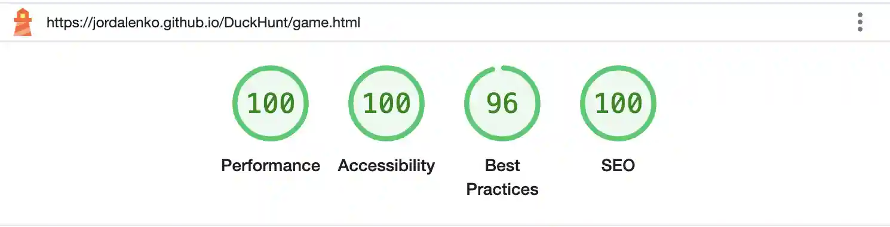
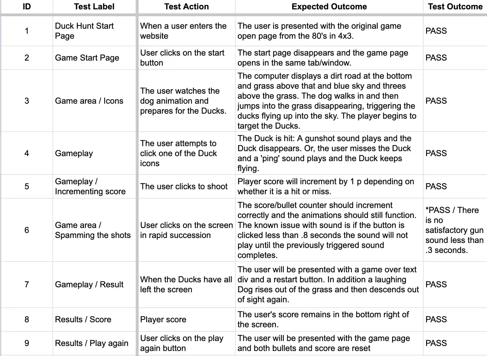

# Duck Hunt JavaScript Game

My second milestone project for code institute is a JavaScript Game called Duck Hunt. It is a classic 80's computer game for everyone. A dog bark introduces the gameplay screen when the start button is pressed. A dog walks in from screen left along the dirt road, sniffing the ground as they go. They pause in the middle of the road, sniffing with more purpose, before jumping into the grass and dispersing the Ducks into the air.

Using hand eye coordination skills, a player needs to successfully target the eight ducks with their 8 available bullets. The goal is to click on the moving Ducks to shoot successfully. If the player hits a Duck a gunshot sound plays and a point is added to their score. If the player misses a ping sound plays and a point is deducted from their score. When all the ducks have left the screen a dog rises from the grass laughing. The game over text appears and the player is given the option to restart the game.

[View Live Game Here.](https://jordalenko.github.io/DuckHunt/)

---

# Responsive

[Am I Responsive](https://ui.dev/amiresponsive?url=https://jordalenko.github.io/DuckHunt/) was used to check if site responsive:

## Aim of the game

To engage gamers with a fun javascript aim and shoot game.

## User Stories

As a visitor to the site I want:

• "To easily understand the purpose of the site/game."  
• "The game to function as expected."  
• "To be able to easily navigate the site."  
• "The site to be responsive and resize for any screen size."
• "To be able to see both my score and the number of bullets remaining at all times."  
• "A shooter game I can play on my phone game."  
• "A simple game I can play anywhere."  
• "A challenging game that I can play even if I only have a few minutes."

## Game Features

I used a single game background as the size of the gameplay area should keep the same aspect to maintain a common relative size of the ducks and shooting area.

There are sounds and animations for both dogs and ducks in the game. The one below opens the gameplay page.

There are two other pages (seen below) in the game. The game start and game over pages both have buttons that allow you to start or restart the game. When clicked on ducks produce a gunshot sound while a miss produces a ping sound.
 
 
Any shot reduces the bullet count by one. A hit adds one point to the score, while the misses subtract a point.
 
 
The buttons on the screens below produce a dog bark and launch gameplay.

 
 
 

## Future Goals

• I would like to develop a score tracker, including a high score list, using local storage and html/css. I have already written a function that generates a final score as part of the gameOver function.
 
 
• I would like to add functionality to the game, including a duck animation after they are shot, dropping them into the grass where they trigger a dog animation where the dog pops up holding the dead duck.
 

• I would like to add sound effects and music throughout.

## Technology Used

Languages

•[Java Script](https://en.wikipedia.org/wiki/JavaScript)
 
•[HTML5](https://en.wikipedia.org/wiki/HTML5)
 
•[CSS3](https://en.wikipedia.org/wiki/CSS)

Other technologies  

* [Bootstrap](https://getbootstrap.com/) - For responsive sizing.
* [Font Awesome](https://fontawesome.com/) - For logos
* [VSCode](https://code.visualstudio.com/) - Editor for local coding.
* [GIT](https://git-scm.com/) - Version control
* [GitHub](https://github.com/) - to  host the repository remotely and deploy the site via pages.

## Testing

### Browser testing

* I have tested that this page works using macOS (Macbook Pro) and PC (Windows).
 
 
* I have tested that this page works in the following browsers using macOS: Chrome, Safari and Firefox.
 
 
* I have tested this page works on iOS devices using Safari browser (iPhone 14 Pro).

### Responsiveness

* Chrome developer tool have been used to check the responsivness.
 
 
* I have tested that this page works on different screen sizes, phones (240px wide) and large screens like a desktop computer screen (1920 x 1080 px).

### Validator Testing

W3 Validation of html flagged a no errors.

- Unnecessary semi-colons were deleted.
- Missing semicolons were added.

W3 Validation of css flagged many errors.

- Font property was corrected to Color property on many .btn css.
- Many .btn css also had a typo where a semicolon was added when a colon should have been added.
- Many .btn css also had an incorrect box-sizing property of content. That was replaced with content-box.
- Many .btn css also had an unnecessary box property which was deleted.

JSHint was used to validate the JavaScript.

Lighthouse scored 100 on performance for game play and game over, while the game start page scored 90.

### Functionality

### Further Testing

* I tested that the border on the buttons disappears and reappears when hovered over.
* I tested that the timeouts all sync with the animations.
* I tested that the buttons are all positioned in a readable place in all screen sizes. 

### Solved bugs

* I didn't encounter any bugs per se.

### Issues and resolutions

- In searching for an existing workflow I found this YouTube video (https://www.youtube.com/watch?v=v6QUZ5veMlA) and began to search for gifs to use (see content section below).

- The first problem I encountered was how to obscure the ducks behind the grass. In this case I decided to use a layer over the bottom third of the bacground image and duck images. This way when the ducks flew they would appear to come from in the grass. 

 - A. The first attempt was to use a file matching the background but with an alpha channel where the sky was so the ducks and the background would show through the alpha channel in the foreground image.

 - Problem: How to assign z-index to each layer and size them so the foreground matched over the background.

 - Solution: I worked with my tutor to create a section for the fg layer, which I assigned a z-index value of 1.

 - B. The solution to problem A worked visually but players could not shoot the ducks. Although the ducks were visible they were effectively behind the fg layer's z-index.

 - Problem: How to recreate the foreground without an alpha that obsucred the area of gameplay.

 - Solution: I created a new foreground image by cropping the background image and then, with the help of a tutor, I applied absolute positioning and left, right and bottom coordinates of 0 to add it over the bottom third of the background. Note: This solution provides cover for the ducks when they exit game play and return to the start position.

- In order to delay the flight of the birds once the game is launched I added a delay to game launch (https://stackoverflow.com/questions/16873889/how-to-create-javascript-delay-function) and I added various animation delays to the animations (https://developer.mozilla.org/en-US/docs/Web/CSS/animation-delay).

- In order to open the game in the same window as the game start page I added "_self" to the window.open method (https://stackoverflow.com/questions/43395782/open-new-html-page-in-the-same-tab-via-javascript#:~:text=You%20have%20to%20quote%20the,)%3B%20this%20code%20should%20work.).

- In order to scope the project properly I abandoned the graphical displays for bullet and score counters. I re-integrated my text counters and solved the issue where the divs for the counters pushed the foreground layer down. I used this w3 link to position the divs over the image properly. https://www.w3schools.com/howto/howto_css_image_text.asp

- Add scoring function to remove a point for missed shots.

- In order to prevent double scoring or no scoring or sound because both the window event and event listeners triggered the shoot function, I moved the scoring function from the shoot function to the window event.  I also changed the shoot function syntax from (event) and event.currentTarget to (e) and e.target to allow the function to match the window function syntax for events. Thanks to tutor Oishin for helping me find the solution.

- Fix the dog animation. 

- When I first created the animation the dog walking and stopping to sniff worked. But the jumping and end animation did not show up. I had neglected to create a separate function for the .hidden = false and .hidden = true. Once I fixed that the dog jump worked. The end animation timeout was not working. Once I fixed the dog jumping this animation worked as expected.

### Known Issues

- If no shots are fired the game over and restart button will not launch.

- If shots are fired too quickly the sound will not play.

- When using a trackpad if the player drags their finger when clicking at all the cursor will grab and ghost the duck gif instead of shooting and disappearing it.

- The buttons and game over text over the index.html and game-over.html are roughly centered at all times but they do move.  I have positioned them for the bootstrap breakpoints and made a couple subtle adjustments for iPhone landscape and portrait.

## Deployment

In order to deploy the [repository](https://jordalenko.github.io/DuckHunt/) from GitHub Pages I performed the following steps.

1. Select **settings** from the GitHub repository.
2. Scroll down to **pages**.
3. Select the **main branch** in **Builds and Deployment** and save.
4. The deployed page link can be found on the sidebar of **GitHub Pages**.

---

## Credits

• Lewis Dillon - September 2024 Gwent Standup facilitator provided important grounding of necessary methods and functions.
 
 
• Brian Macharia - My mentor offered invaluable advice on scope and links to MDN docs for various processes and features.
 
 
• Oisin - A particularly strong tutor was also integral to figuring out how to streamline my code, not just making it more efficient but unlocking blocks the complexity presented.

### Content

Image Sources:

Game start page image was sourced from (https://medium.com/everything-80s/the-story-of-duck-hunt-the-original-backbone-of-the-nes-6d4b18c0ff89)

Background image was sourced from [repository] (https://github.com/vaielab/DuckHuntCss/blob/master/stage.png)

Duck gifs were sourced from (https://lagg.fr/wp-content/uploads/2022/11/duck.gif) and (https://images.app.goo.gl/QE9Z6SLwoDYBcaMZA).

Dog graphics were sourced from (https://github.com/polon59/Duck_shooter_game_JS/blob/master/resources/sprites/dog).

Sound Sources:

Bullet sound effects were sourced from (https://pixabay.com/sound-effects/search/bullet/).

Duck sound effects were sourced from (https://pixabay.com/sound-effects/search/quack/).

Dog sound effect was sourced from (https://mixkit.co/free-sound-effects/dog/).

### Acknowledgements

My mentor was particularly helpful on this project.