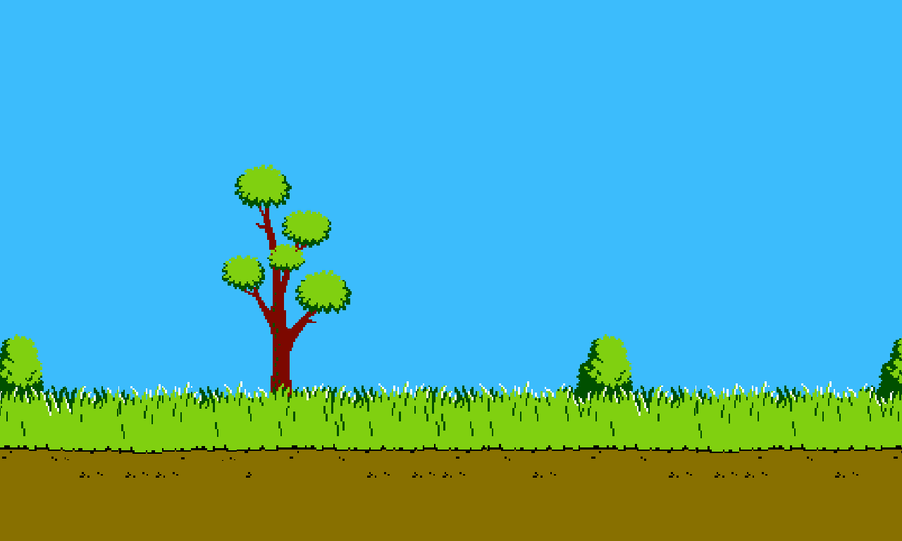

# Duck Hunt JavaScript

# Aim of the game

---

To engage gamers.

The client have offered the following guidance for the new site.

1. A JavaScript game to shoot ducks.

---

## UX:

---

## Client Stories

"As a gamer I want a fun engaging game."

---

## Wireframe Mockups

## Phone Size

## Tablet Size

## Desktop Size

---

## Game Features

### Hero Image with Text

---

## Future Goals

---

## Technology Used

* [Bootstrap](https://getbootstrap.com/) - For responsive sizing.
* [Font Awesome](https://fontawesome.com/) - For logos
* [VSCode](https://code.visualstudio.com/) - Editor for local coding.
* [GIT](https://git-scm.com/) - Version control
* [GitHub](https://github.com/) - to  host the repository remotely and deploy the site via pages.

---

## Testing

W3 Validation of html flagged a number of errors.

- Duplicate tags and ID's were deleted.
- Unclosed divs were closed.
- Duplicate divs were deleted.
- Unnecessary elements (p, strong) were deleted.
- many unnecessary trailing slashes were deleted.

W3 Validation of css flagged one error.

- Too many values in .card-img-top for 'center/cover'. Deleted center value.

Lighthouse scored 73 on performance

- Flagged image file sizes, contentful paint as main issues. Resized all images to widest dimension of 600px. Fter reformatting and deleting unecessary images the performance score improved to 91.

Wave flagged errors for no text on social media links (disregarded).

### Issues and resolutions

### Known Issues

---

## Deployment

In order to deploy the [repository](https://jordalenko.github.io/DuckHunt/) from GitHub Pages I performed the following steps.

1. Select **settings** from the GitHub repository.
2. Scroll down to **pages**.
3. Select the **main branch** in **Builds and Deployment** and save.
4. The deployed page link can be found on the sidebar of **GitHub Pages**.

---

## Credits

### Content

Image Sources:

background image was sourced from [repository] (https://github.com/vaielab/DuckHuntCss/blob/master/stage.png)

Duck gifs were sourced from (https://lagg.fr/wp-content/uploads/2022/11/duck.gif) and (https://images.app.goo.gl/QE9Z6SLwoDYBcaMZA).

Sound Sources:

Bullet sound effects were sourced from (https://pixabay.com/sound-effects/search/bullet/).

### Acknowledgements

